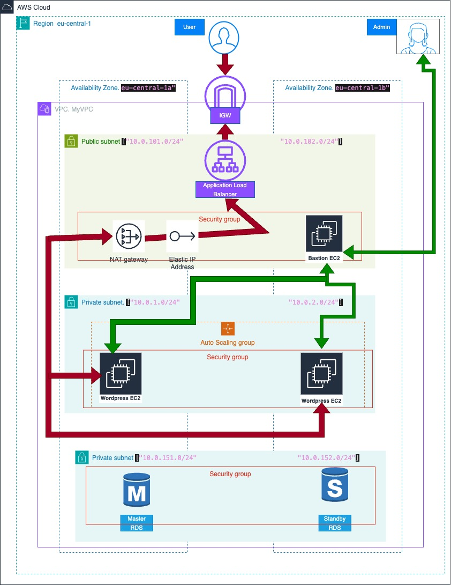

 


# WordPress Terraform Project

This project is designed to automate the infrastructure deployment for a WordPress environment using Terraform. Below is a description of each file in the project and the Terraform resources and blocks they contain.

## File Structure

### 1. `c1-version.tf`
This file defines the required Terraform version and providers.

- **Blocks:**
  - `terraform`: Specifies the required version.
  - `provider`: Defines the cloud provider (e.g., AWS).

### 2. `c2-generic-variables.tf`
This file contains generic variables that are used across the Terraform project.


### 3. `c3-local-values.tf`
This file defines local values that are derived from the variables defined in the project.


### 4. `c4-01-vpc-variables.tf`, `c4-02-vpc-module.tf`, `c4-03-vpc-outputs.tf`
These files are used to define and configure the Virtual Private Cloud (VPC) for the project.

### 5. `c5-01-securitygroup-variables.tf`, `c5-02-securitygroup-outputs.tf`, `c5-03-securitygroup-bastionsg.tf`, `c5-04-securitygroup-privatesg.tf`, `c5-05-securitygroup-Loadbalancersg.tf`, `c5-06-securitygroup-rdsdbsg.tf`
These files define the security groups for various components such as bastion hosts, private instances, load balancers, and RDS databases.

### 6. `c6-01-datasource-ami.tf`
This file fetches the Amazon Machine Image (AMI) information.

### 7. `c7-01-ec2instance-variables.tf`, `c7-02-ec2instance-outputs.tf`, `c7-03-ec2instance-bastion.tf`, `c7-04-ec2instance-private.tf`
These files manage the EC2 instance configurations, including variables, outputs, bastion host instances, and private instances.

### 8. `c8-elasticip.tf`
This file configures the Elastic IP for instances or other resources.


### 9. `c9-nullresource-provisioners.tf`
This file contains `null_resource` configurations and provisioners.

### 10. `c10-01-ELB-classic-loadbalancer-variables.tf`, `c10-02-ELB-classic-loadbalancer.tf`, `c10-03-ELB-classic-loadbalancer-outputs.tf`
These files define and manage a classic Elastic Load Balancer (ELB) for the project.

### 11. `c11-01-ALB-application-loadbalancer-variables.tf`, `c11-02-ALB-application-loadbalancer.tf`, `c11-03-ALB-application-loadbalancer-outputs.tf`
These files define and manage an Application Load Balancer (ALB).

### 12. `c13-01-rdsdb-variables.tf`, `c13-02-rdsdb.tf`, `c13-03-rdsdb-outputs.tf`
These files configure an RDS (Relational Database Service) instance.


### 13. `c14-01-autoscaling-launchtemplate-resource.tf`, `c14-02-autoscaling-resource.tf`, `c14-03-autoscaling-with-launchtemplate-outputs.tf`
These files manage auto-scaling groups and launch templates.

### 14. `app1-install.tmpl`
This is a template file that contains installation scripts for provisioning WordPress or other applications on EC2 instances.

### 15. `.gitignore`
This file specifies files and directories that should be ignored by Git, such as Terraform state files and sensitive information.

### 16. `private-key/`
This directory contains sensitive private key files. **Be cautious** not to share or expose these files publicly.

- `Terraform-Key.pem`: A PEM key used to access EC2 instances.
- `admin-anas_accessKeys.csv`: Contains access keys for AWS.

### 17. `local-exec-output-files/`
This directory contains output files generated during local execution of commands or Terraform operations.

- `creation-time-vpc-id.txt`: Stores VPC ID and creation time details.

## Usage

1. Clone the repository:
   ```bash
   git clone <repo_url>
   ```

2. Initialize Terraform:
   ```bash
   terraform init
   ```

3. Apply the Terraform configuration:
   ```bash
   terraform apply
   ```

4. Review the outputs for instance details, load balancer endpoints, and other resources.

## Notes

- Make sure to configure your AWS credentials before running the Terraform commands.
- Ensure that the private key file is secured and accessible only by authorized users.
- This project sets up a VPC, EC2 instances, security groups, RDS, and load balancers for hosting a WordPress application.

